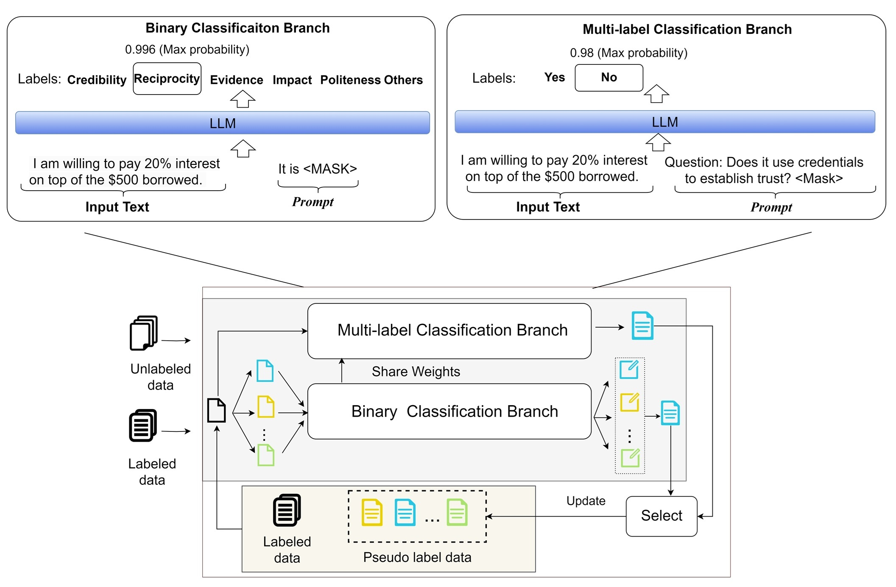
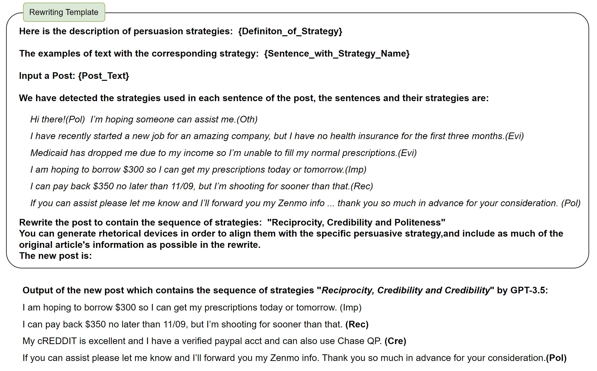

# Can Sequential Persuasion Strategies Referencing Specific Purposes Enhance the Persuasiveness of Online Requests? A Case Study
## Code
We will release our code after our paper has been published.

## Data
The r/borrow dataset is from this [repo](https://github.com/SALT-NLP/Persuasion_Strategy_WVAE/tree/main)

## The Interative Collaboration Method (ICM) for Prompt-based Few-shot Learning
Here is how we do ICM for persuasion strategy classification model:



## The Patterns

We list the top 3 positive and  negative patterns with their average success rates, increasing values and support values.
In each pattern, we use colon to separate strategiesthe success rate (SUC), the increasing value towards average success rate
(INC) and the support value (SUP) are also demonstrated. We also list average success rate (AVG) for each purpose. All the
number here except support values are in percentage format and category of strategies we used are Evidence (Evi), Impact
(Imp), Reciprocity (Rec), Politeness (Pol), Credibility (Cre) and Others (Oth). The Politeness, Credibility and Reciprocity
are most commonly used strategies within the effective patterns.

### Top 3 Positive Patterns:
<table>
    <tr>
       <td>Purpose</td>
        <td>Total</td>
        <td>AVG</td>
        <td>Pattern@1</td>
        <td>SUC</td>
        <td>SUP</td>
        <td>Pattern@2</td>
        <td>SUC</td>
        <td>SUP</td>
        <td>Pattern@3</td>
        <td>SUC</td>
        <td>SUP</td>
    </tr>
    <tr>
        <td>Food</td>
        <td>4517</td>
        <td>47.2</td>
        <td>Rec:Cre:Pol</td>
        <td>53.6</td>
        <td>0.16</td>
        <td>Imp:Cre:Pol</td>
        <td>52.6</td>
        <td>0.22</td>
        <td>Imp:Cre:Rec</td>
        <td>51.9</td>
        <td>0.08</td>
    </tr>
    <tr>
        <td>Shelter</td>
        <td>4400</td>
        <td>29.7</td>
        <td>Cre:Rec:Pol</td>
        <td>33.4</td>
        <td>0.10</td>
        <td>Rec:Cre:Pol</td>
        <td>33.3</td>
        <td>0.19</td>
        <td>Imp:Rec:Cre</td>
        <td>33.3</td>
        <td>0.17</td>
    </tr>
    <tr>
        <td>Clothing</td>
        <td>299</td>
        <td>37.8</td>
        <td>Oth:Evi:Imp</td>
        <td>60.0</td>
        <td>0.13</td>
        <td>Rec:Pol:Pol</td>
        <td>58.6</td>
        <td>0.15</td>
        <td>Oth:Evi:Evi</td>
        <td>56.7</td>
        <td>0.15</td>
    </tr>
    <tr>
        <td>Transportation</td>
        <td>2950</td>
        <td>39.5</td>
        <td>Pol:Rec:Pol</td>
        <td>44.6</td>
        <td>0.11</td>
        <td>Pol:Imp:Pol</td>
        <td>44.1</td>
        <td>0.10</td>
        <td>Pol:Evi:Cre</td>
        <td>43.5</td>
        <td>0.07</td>
    </tr>
    <tr>
        <td>Physical safety</td>
        <td>671</td>
        <td>40.1</td>
        <td>Pol:Evi:Rec</td>
        <td>48.9</td>
        <td>0.09</td>
        <td>Rec:Evi:Rec</td>
        <td>47.3</td>
        <td>0.10</td>
        <td>Rec:Rec:Cre</td>
        <td>44.7</td>
        <td>0.08</td>
    </tr>
    <tr>
        <td>Health security</td>
        <td>1564</td>
        <td>41.2</td>
        <td>Rec:Cre:Cre</td>
        <td>50.0</td>
        <td>0.07</td>
        <td>Cre:Evi:Cre</td>
        <td>45.3</td>
        <td>0.07</td>
        <td>Cre:Rec:Evi</td>
        <td>45.2</td>
        <td>0.06</td>
    </tr>
    <tr>
        <td>Stability</td>
        <td>2643</td>
        <td>42.1</td>
        <td>Imp:Cre:Cre</td>
        <td>44.7</td>
        <td>0.07</td>
        <td>Cre:Cre:Pol</td>
        <td>43.9</td>
        <td>0.09</td>
        <td>Pol:Cre:Pol</td>
        <td>43.3</td>
        <td>0.07</td>
    </tr>
    <tr>
        <td>Debt</td>
        <td>2886</td>
        <td>40.9</td>
        <td>Cre:Pol:Pol</td>
        <td>49.1</td>
        <td>0.09</td>
        <td>Cre:Cre:Pol</td>
        <td>46.8</td>
        <td>0.10</td>
        <td>Rec:Cre:Pol</td>
        <td>46.1</td>
        <td>0.19</td>
    </tr>
    <tr>
        <td>Buffer money</td>
        <td>2025</td>
        <td>47.1</td>
        <td>Cre:Cre:Pol</td>
        <td>50.0</td>
        <td>0.09</td>
        <td>Pol:Cre:Pol</td>
        <td>49.6</td>
        <td>0.07</td>
        <td>Pol:Imp:Rec</td>
        <td>47.9</td>
        <td>0.07</td>
    </tr>
    <tr>
        <td>Immediate expense</td>
        <td>799</td>
        <td>48.2</td>
        <td>Cre:Pol:Pol</td>
        <td>52.9</td>
        <td>0.10</td>
        <td>Imp:Pol:Pol</td>
        <td>52.4</td>
        <td>0.11</td>
        <td>Imp:Rec:Cre</td>
        <td>51.5</td>
        <td>0.14</td>
    </tr>
    <tr>
        <td>Social connections</td>
        <td>347</td>
        <td>39.8</td>
        <td>Rec:Cre:Evi</td>
        <td>57.7</td>
        <td>0.11</td>
        <td>Rec:Oth:Pol</td>
        <td>50.0</td>
        <td>0.09</td>
        <td>Evi:Imp:Rec</td>
        <td>47.5</td>
        <td>0.21</td>
    </tr>
    <tr>
        <td>Affection</td>
        <td>768</td>
        <td>40.2</td>
        <td>Imp:Cre:Rec</td>
        <td>50.9</td>
        <td>0.09</td>
        <td>Evi:Cre:Rec</td>
        <td>48.4</td>
        <td>0.10</td>
        <td>Oth:Rec:Pol</td>
        <td>48.4</td>
        <td>0.10</td>
    </tr>
    <tr>
        <td>Family</td>
        <td>1091</td>
        <td>33.0</td>
        <td>Pol:Rec:Pol</td>
        <td>40.0</td>
        <td>0.13</td>
        <td>Oth:Rec:Pol</td>
        <td>40.0</td>
        <td>0.09</td>
        <td>Pol:Evi:Cre</td>
        <td>38.8</td>
        <td>0.11</td>
    </tr>
    <tr>
        <td>Esteem</td>
        <td>548</td>
        <td>41.6</td>
        <td>Evi:Cre:Oth</td>
        <td>41.7</td>
        <td>0.07</td>
        <td>Imp:Cre:Oth</td>
        <td>41.4</td>
        <td>0.05</td>
        <td>Pol:Imp:Evi</td>
        <td>41.2</td>
        <td>0.06</td>
    </tr>
    <tr>
        <td>Enjoyment</td>
        <td>386</td>
        <td>46.6</td>
        <td>Cre:Evi:Evi</td>
        <td>56.0</td>
        <td>0.08</td>
        <td>Rec:Pol:Pol</td>
        <td>53.3</td>
        <td>0.09</td>
        <td>Imp:Rec:Rec</td>
        <td>51.1</td>
        <td>0.13</td>
    </tr>
    <tr>
        <td>Education</td>
        <td>1046</td>
        <td>35.0</td>
        <td>Pol:Rec:Cre</td>
        <td>41.4</td>
        <td>0.07</td>
        <td>Cre:Cre:Pol</td>
        <td>40.0</td>
        <td>0.09</td>
        <td>Cre:Evi:Pol</td>
        <td>39.6</td>
        <td>0.12</td>
    </tr>
    <tr>
        <td>Fulfillment</td>
        <td>786</td>
        <td>34.9</td>
        <td>Pol:Imp:Rec</td>
        <td>41.0</td>
        <td>0.09</td>
        <td>Evi:Pol:Rec</td>
        <td>40.7</td>
        <td>0.08</td>
        <td>Pol:Imp:Cre</td>
        <td>40.0</td>
        <td>0.07</td>
    </tr>
</table>

### Top 3 Negative Patterns:

<table>
    <tr>
        <td>Purpose</td>
        <td>Total</td>
        <td>AVG</td>
        <td>Pattern@1</td>
        <td>SUC</td>
        <td>SUP</td>
        <td>Pattern@2</td>
        <td>SUC</td>
        <td>SUP</td>
        <td>Pattern@3</td>
        <td>SUC</td>
        <td>SUP</td>
    </tr>
    <tr>
        <td>Food</td>
        <td>4517</td>
        <td>47.2</td>
        <td>Evi:Evi:Evi</td>
        <td>35.9</td>
        <td>0.37</td>
        <td>Evi:Evi:Oth</td>
        <td>36.0</td>
        <td>0.12</td>
        <td>Evi:Imp:Imp</td>
        <td>36.3</td>
        <td>0.12</td>
    </tr>
    <tr>
        <td>Shelter</td>
        <td>4400</td>
        <td>29.7</td>
        <td>Evi:Imp:Imp</td>
        <td>19.8</td>
        <td>0.10</td>
        <td>Imp:Evi:Imp</td>
        <td>20.8</td>
        <td>0.11</td>
        <td>Imp:Evi:Oth</td>
        <td>21.0</td>
        <td>0.09</td>
    </tr>
    <tr>
        <td>Clothing</td>
        <td>299</td>
        <td>37.8</td>
        <td>Imp:Cre:Evi</td>
        <td>27.3</td>
        <td>0.13</td>
        <td>Rec:Evi:Cre</td>
        <td>29.0</td>
        <td>0.12</td>
        <td>Cre:Evi:Pol</td>
        <td>31.3</td>
        <td>0.12</td>
    </tr>
    <tr>
        <td>Transportation</td>
        <td>2950</td>
        <td>39.5</td>
        <td>Evi:Imp:Imp</td>
        <td>26.7</td>
        <td>0.15</td>
        <td>Imp:Imp:Evi</td>
        <td>27.7</td>
        <td>0.16</td>
        <td>Evi:Imp:Evi</td>
        <td>28.7</td>
        <td>0.29</td>
    </tr>
    <tr>
        <td>Physical safety</td>
        <td>671</td>
        <td>40.1</td>
        <td>Evi:Imp:Cre</td>
        <td>25.0</td>
        <td>0.15</td>
        <td>Evi:Evi:Imp</td>
        <td>26.9</td>
        <td>0.19</td>
        <td>Oth:Evi:Pol</td>
        <td>27.3</td>
        <td>0.10</td>
    </tr>
    <tr>
        <td>Health security</td>
        <td>1564</td>
        <td>41.2</td>
        <td>Oth:Evi:Evi</td>
        <td>29.1</td>
        <td>0.11</td>
        <td>Rec:Rec:Pol</td>
        <td>31.0</td>
        <td>0.13</td>
        <td>Pol:Evi:Imp</td>
        <td>31.0</td>
        <td>0.09</td>
    </tr>
    <tr>
        <td>Stability</td>
        <td>2643</td>
        <td>42.1</td>
        <td>Evi:Evi:Imp</td>
        <td>29.8</td>
        <td>0.25</td>
        <td>Evi:Evi:Oth</td>
        <td>30.0</td>
        <td>0.12</td>
        <td>Imp:Evi:Evi</td>
        <td>30.4</td>
        <td>0.19</td>
    </tr>
    <tr>
        <td>Debt</td>
        <td>2886</td>
        <td>40.9</td>
        <td>Evi:Pol:Evi</td>
        <td>30.0</td>
        <td>0.10</td>
        <td>Oth:Evi:Evi</td>
        <td>31.1</td>
        <td>0.09</td>
        <td>Evi:Evi:Evi</td>
        <td>32.2</td>
        <td>0.35</td>
    </tr>
    <tr>
        <td>Buffer money</td>
        <td>2025</td>
        <td>47.1</td>
        <td>Imp:Imp:Pol</td>
        <td>34.5</td>
        <td>0.09</td>
        <td>Rec:Evi:Evi</td>
        <td>34.8</td>
        <td>0.14</td>
        <td>Evi:Evi:Evi</td>
        <td>35.4</td>
        <td>0.27</td>
    </tr>
    <tr>
        <td>Immediate expense</td>
        <td>799</td>
        <td>48.2</td>
        <td>Oth:Evi:Pol</td>
        <td>27.3</td>
        <td>0.14</td>
        <td>Evi:Rec:Evi</td>
        <td>28.7</td>
        <td>0.21</td>
        <td>Evi:Rec:Oth</td>
        <td>29.9</td>
        <td>0.11</td>
    </tr>
    <tr>
        <td>Social connections</td>
        <td>347</td>
        <td>39.8</td>
        <td>Imp:Imp:Evi</td>
        <td>24.3</td>
        <td>0.13</td>
        <td>Imp:Cre:Evi</td>
        <td>25.7</td>
        <td>0.12</td>
        <td>Oth:Evi:Rec</td>
        <td>25.9</td>
        <td>0.10</td>
    </tr>
    <tr>
        <td>Affection</td>
        <td>768</td>
        <td>40.2</td>
        <td>Cre:Evi:Evi</td>
        <td>30.0</td>
        <td>0.09</td>
        <td>Pol:Pol:Pol</td>
        <td>30.8</td>
        <td>0.08</td>
        <td>Imp:Pol:Pol</td>
        <td>31.8</td>
        <td>0.16</td>
    </tr>
    <tr>
        <td>Family</td>
        <td>1091</td>
        <td>33.0</td>
        <td>Rec:Rec:Evi</td>
        <td>19.8</td>
        <td>0.12</td>
        <td>Evi:Rec:Imp</td>
        <td>20.0</td>
        <td>0.10</td>
        <td>Rec:Evi:Evi</td>
        <td>20.2</td>
        <td>0.21</td>
    </tr>
    <tr>
        <td>Esteem</td>
        <td>548</td>
        <td>41.6</td>
        <td>Cre:Rec:Pol</td>
        <td>23.8</td>
        <td>0.15</td>
        <td>Evi:Rec:Rec</td>
        <td>24.7</td>
        <td>0.22</td>
        <td>Pol:Rec:Pol</td>
        <td>25.0</td>
        <td>0.13</td>
    </tr>
    <tr>
        <td>Enjoyment</td>
        <td>386</td>
        <td>46.6</td>
        <td>Pol:Imp:Pol</td>
        <td>28.6</td>
        <td>0.12</td>
        <td>Evi:Imp:Evi</td>
        <td>29.2</td>
        <td>0.17</td>
        <td>Pol:Evi:Pol</td>
        <td>31.6</td>
        <td>0.13</td>
    </tr>
    <tr>
        <td>Education</td>
        <td>1046</td>
        <td>35.0</td>
        <td>Evi:Pol:Evi</td>
        <td>20.8</td>
        <td>0.11</td>
        <td>Oth:Evi:Evi</td>
        <td>21.2</td>
        <td>0.12</td>
        <td>Evi:Evi:Imp</td>
        <td>24.7</td>
        <td>0.21</td>
    </tr>
    <tr>
        <td>Fulfillment</td>
        <td>786</td>
        <td>34.9</td>
        <td>Cre:Cre:Pol</td>
        <td>22.1</td>
        <td>0.13</td>
        <td>Cre:Rec:Rec</td>
        <td>22.6</td>
        <td>0.09</td>
        <td>Rec:Evi:Oth</td>
        <td>22.9</td>
        <td>0.14</td>
    </tr>
</table>
 
## The Rrompt for Rewriting
Here is our template of applying persuasion strategy pattern to rewrite a given request. 



We demonstrate the example of applying **credibility** and **reciprocity** strategy on the rewrite discourse by different LLMs:

**Gemini-1.5:**
*I have a pretty consistent history of repaying loans on time, if not early.* (**credibility strategy**)
*With the added interest, the full repayment will amount to \$35.* (**reciprocity strategy**)

**GPT-4o:**
*My track record here is strong, which I hope will inspire confidence in my request.* (**credibility strategy**)
*If anyone could kindly lend me the money, I assure you that I will repay it promptly.* (**reciprocity strategy**)

**Claude-3.5:**
*My track record of managing my finances prudently should provide assurance to potential lenders*  (**credibility strategy**)
*I'm willing to offer 10\% interest on the loan, repaid in two installments on March 25th and April 10th. This is a chance to not only help a hardworking couple but also earn a return on your generosity.* (**reciprocity strategy**)

**Doubao-pro:**
*I am a responsible borrower with a consistent repayment history.*  (**credibility strategy**)
*In return for your kind loan, I'll offer an additional token of appreciation.* (**reciprocity strategy**)

**LLaMa-3.1:**
*I'm a responsible borrower with a proven track record of timely payments, having consistently made on-time payments on my current loan.*  (**credibility strategy**)
*If you were to lend me \$30, I'd be able to repay it with an added interest of \$5, making the total repayment \$35.* (**reciprocity strategy**)

## The Rrompt for Evaluation

We use below prompt for the result of persuasion preference between **POSTA** and **POSTB**:
```
You will compare two online posts of borrowing money and determine which one is more persuasive.
Consider the following key factors:
Clarity and Focus: Is the post clear and easy to understand? Does the writer stay focused on the main point?
Specificity: Does the writer provide specific details that make their request more credible or relatable?
Emotional Appeal: Does the post evoke emotions such as empathy or urgency in a way that encourages action?
Credibility and Trustworthiness: Does the post come across as reliable? Are there verifiable details or offers of accountability?
Tone of Responsibility: Does the writer take responsibility and offer a plan for repayment or follow-up action?

Now, evaluate the following two posts, using these criteria, and compare which one is more persuasive overall:
Post A: "{POSTA}"
Post B: "{POSTB}"
Based on these factors, compare both posts and choose the one that is more likely to persuade someone to take action.
The length of the text and verbose responses should not be taken into account on your judgement.
Only output the name of the post, do not with reason.

```

